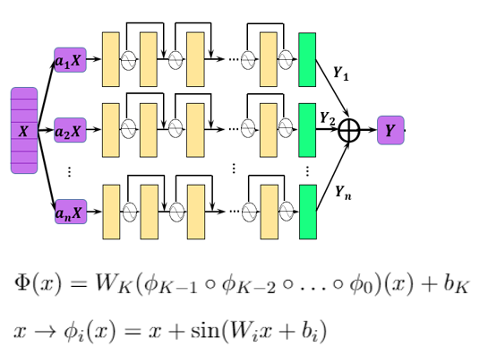

# 模型名称

> 利用MindSpore实现不同几何边界下的2D Poisson方程求解（流体）：
$$
\Delta u = -sin(4\pi x)sin(4\pi y)
$$

# 项目概览
> 
> 基于MindSpore科学计算套件包MindElec，采用PINNs方法实现在不同几何边界下的2D Poisson方程求解。具体几何边界包括：矩形、圆、三角形、五边形，边界条件可以通过方程的解析解直接指定。
> 
> 首先需要补充上述几种几何体的建模及采样算法(圆与矩形MindElec已经完备，三角形和多边形另外补充实现)，然后通过神经网络设计求解上述方程。


## 模型架构

> 使用深度学习模型进行训练，使用多通道残差卷积网络，激活函数采用 `sin` 函数。模型其结构如下图：
> 


## 数据集

> 对目标几何体进行边界和内部采样，获得训练和测试数据。
> 项目实现对圆形、三角形、矩形和多边形的内部和边界**随机**采样算法。


## 环境要求

> ```python
> # requirements.txt
> mindspoer >= 1.5.0
> mindelec
> numpy
> matplotlib
> easydict
> ```

## 快速入门
> 仅支持Ascend硬件平台。
> * 训练命令
> ```bash
> python train.py -g <geom_name>
> ```
> `geom_name` 可选 `{disk, triangle, rectangle, polygon}`。
> 
> 第二阶段训练，则通过 `-w` 指定初始参数路径。
> ```bash
> python train.py -g <geom_name> -w <param_path.ckpt>
> ```
> * 推理命令
> ```bash
> python eval.py -g <geom_name> -w <param_path.ckpt>
> ```
> `geom_name` 可选 `{disk, triangle, rectangle, polygon}`。 `<param_path.ckpt>`为训练好的ckpt文件（参数）路径。


## 脚本说明


### 项目目录结构

> ```bash
> poisson2D/
> │  eval.py                   # 评估脚本
> │  README.md                 # 文档介绍
> │  requirements.txt          # 所需python库
> │  train.py                  # 训练脚本
> │
> ├─geom/
> │      geometry_2d.py        # 几何体定义及内部和边界采样
> │
> ├─images/                    # README绘图使用图片
> │
> └─src/
>       callback.py            # 回调函数，打印损失、保存模型等
>       config.py              # 参数配置文件
>       dataset.py             # 数据集生成等
>       poisson2d.py           # PINN模型定义
>       utils.py               # 其他重复使用的函数
>```


### 脚本参数

> ```python
> # 矩形、圆、三角形、五边形
> sampling_config = ed({
>     "disk": ed({                         # disk 采样设置
>         'domain': ed({                   # 内部采样
>             'random_sampling': True,     # 随机采样
>             'size': 65536,               # 采样点数
>         }),
>         'BC': ed({                       # 边界采样
>             'random_sampling': True,     # 随机采样
>             'size': 8192,                # 采样点数
>         })
>     }),
>
>     "polygon": ed({                      # 多边形采样
>         'domain': ed({
>             'random_sampling': True,
>             'size': 65536,
>         }),
>         'BC': ed({
>             'random_sampling': True,
>             'size': 8192,
>         }),
>     }),
>
>     "triangle": ed({                     # 三角形采样
>         'domain': ed({
>             'random_sampling': True,
>             'size': 65536,
>         }),
>         'BC': ed({
>             'random_sampling': True,
>             'size': 8192,
>         }),
>     }),
>
>     "rectangle": ed({                    # 矩形采样
>         'domain': ed({
>             'random_sampling': True,
>             'size': 65536,
>         }),
>         'BC': ed({
>             'random_sampling': True,
>             'size': 8192,
>         }),
>     }),
> })
>
>
> # config
> poisson_2d_config = ed({
>     "name": "poisson2d",                            # 任务名，不重要
>     "geom_define": ed({                             # 几何体定义
>         "disk": ed({                                # 圆形
>             "name": "disk",                         # 名字
>             "center": [0, 0],                       # 圆心
>             "radius": 1,                            # 半径
>         }),
>
>         "rectangle": ed({                           # 矩形
>             "name": "rectangle",
>             "coord_min": [-1, -0.5],                # 最小坐标
>             "coord_max": [1, 0.5],                  # 最大坐标
>         }),
>
>         "triangle": ed({                            # 三角形
>             "name": "triangle",
>             "vertex": [[-1, -1], [1, -1], [0, 1]],  # 三个顶点
>         }),
>
>         "polygon": ed({                             # 多边形
>             "name": "polygon",
>             "vertex": [[0,1], [0.951, 0.309],
>                        [0.588, -0.809], [-0.588, -0.809],
>                        [-0.951, 0.309]],            # 五边形顶点
>         }),
>     }),
>     # 训练参数
>     "wave_number": 2,                # 波数，乘以 2*pi 为题目要求的 4*pi
>     "epochs": 1000,                  # epoch数量
>     "batch_size": 128,               # 训练batch_size
>     "lr": 1e-3,                      # 学习率
>     "optimizer": "adam",             # 优化器
> 
>     # 神经网络配置
>     "in_channel": 2,                 # 输入通道数
>     "out_channel": 1,                # 输出通道数
>     "layers": 4,                     # 重复次数
>     "neurons": 64,                   # 每层的神经元数量
>
>     # 测试配置
>     "param_path": "checkpoints/xxx.ckpt",  # 训练好的权重，也可通过命令行传参指定
>     "plot_size": 201,                # 绘图网格
> })
>```


## 训练过程

### 训练

> 训练命令：参考快速入门，如果要保存控制台的日志输出，可以使用 Linux 的 `tee` 命令定向输出文件，例如输出到 `log.out`。
> ```bash
> python train.py -g <geom_name> | tee log.out
> ```
> 
> 训练分为两个阶段，第一阶段使用 `Adam` 优化器，学习步长 `lr=0.001`。
> 第二阶段为微调，使用 `Agagrad` 优化器，学习步长 `lr=0.0001`，其他配置不变。手动调节 `config.py` 的配置修改。


### 训练过程日志

> ```log
> Geometry is disk.
> <================= Begin Trainning =================>
> Epoch: 1, loss: 26.59669.
> epoch time: 66542.866 ms, per step time: 129.967 ms
> Current epoch: 1, loss: 26.59668731689453, saved checkpoint.
> Epoch: 2, loss: 24.22429.
> epoch time: 2752.939 ms, per step time: 5.377 ms
> Current epoch: 2, loss: 24.224285125732422, saved checkpoint.
> Epoch: 3, loss: 29.27661.
> epoch time: 2692.090 ms, per step time: 5.258 ms
> ......
> Epoch: 1000, loss: 0.00331.
> epoch time: 2920.276 ms, per step time: 5.704 ms
> Train task total spends 48.461 minutes.
> 
> <================= End Trainning =================>
> ```

### 损失记录
> * 第一阶段损失
> 
> 
> * 第二阶段（微调阶段）损失
> 
> 
> 从图中可以看出，第一阶段训练500~1000个epoch即可，图中给出2000个epoch；之后进入第二阶段的微调阶段，微调阶段取 500 epoch。

## 推理

### 推理过程
> 推理命令：
> ```bash
> python eval.py -g <geom_name> -w <param_path.ckpt>
> ```
> `geom_name` 可选 `{disk, triangle, rectangle, polygon}`。 `<param_path.ckpt>` 为训练好的ckpt文件（参数）路径。
> 推理结果会输出在当前目录下的 `output/` 文件夹

### 推理结果
> 相对误差计算：
> $$
> 相对误差 = \frac{最大绝对误差}{最大真实值}
> $$
> 推理结果如下所示：
> |                | disk   |  triangle | rectangle | polygon |
> | -------------- | ----   | --------- | --------- | ------- |
> |内部区域相对误差 |  2.13%  |  1.88%  |  2.59% |  3.31% |
> |边界相对误差     |  2.55% |  2.46%   |  inf   |  3.36% |
> 
> 
> 注：由于所模拟的矩形边界值真实值全为0，故计算的相对误差为无穷大。

### 推理展示

> `disk` 结果：
> 
> 
> `triangle` 结果：
> 
> 
> `rectangle` 结果：
> 
> 
> `polygon` 结果
> 
>


## 性能

### 训练性能

> | Parameters                 | Ascend 910                                                   |
> | ----------------- | ---------------- | 
> | Model Version              | Poisson 2D            |  
> | Resource                   | Ascend: 1*Ascend 910, CPU: 24vCPUs 96GB | 
> | uploaded Date              | 10/15/2022 (month/day/year)                                  | 
> | MindSpore Version          | >= 1.15.1                                                        | 
> | Dataset                    | 二维几何体内部、边界采样   | 
> | Training Parameters        | epoch=1000(第二阶段epoch=500), learning_rate=1e-3(第二阶段1e-4)；steps per epoch=576, batch_size =128             | 
> | Optimizer                  | Adam（第二阶段Adagrad）               | 
> | Loss Function              | L2范数                                      | 
> | outputs                    | 标量值 $u$             | 
> | Loss                       | 0.0002~0.0006（不同几何体略有不同）     | 
> | Speed                      | 3.3 s/epoch（第一个epoch耗时较长，约101秒）      | 
> | Total time                 | 72 minutes / (1000 + 500 epoch)           | 
> | Parameters (KB)            | 273 KB/model              | 
> | Scripts                    | [link](https://gitee.com/forcekeng/pinn_poisson2d)   |

### 推理性能

> | Parameters          | Ascend                      |
> | ------------------- | --------------------------- |
> | Resource            | Ascend: 1*Ascend 910, CPU: 24vCPUs 96GB    |
> | Uploaded Date       | 9/30/2022 (month/day/year) |
> | MindSpore Version   | >= 1.15.1                       |
> | Dataset             | 随机对几何体内部和边界采样，采样点数分别外 65536和8192.   |
> | outputs             |  $u$                |
> | Model for inference | 273KB (.ckpt)             |
> | Total time                 | 45 seconds/model| 


## 随机情况说明

> 不同训练收敛的所需epoch可能不一样，通常在几十至两百个epoch左右。本项目对所有几何体的随机数种子均为 `123456`，并未对每个几何体的训练寻找最佳的随机数种子。


## 贡献指南

如果你想参与贡献昇思的工作当中，请阅读[昇思贡献指南](https://gitee.com/mindspore/models/blob/master/CONTRIBUTING_CN.md)和[how_to_contribute](https://gitee.com/mindspore/models/tree/master/how_to_contribute)

### 贡献者

此部分根据自己的情况进行更改，填写自己的院校和邮箱

* [耿力](https://gitee.com/forcekeng) (同济大学)
* e-mail: forcekeng@126.com

## ModelZoo 主页

请浏览官方[主页](https://gitee.com/mindspore/models)。


## 参考
几何体采样实现参考:
[Mindelec](https://gitee.com/mindspore/mindscience/tree/master/MindElec)
 [DeepXDE](https://github.com/lululxvi/deepxde)

